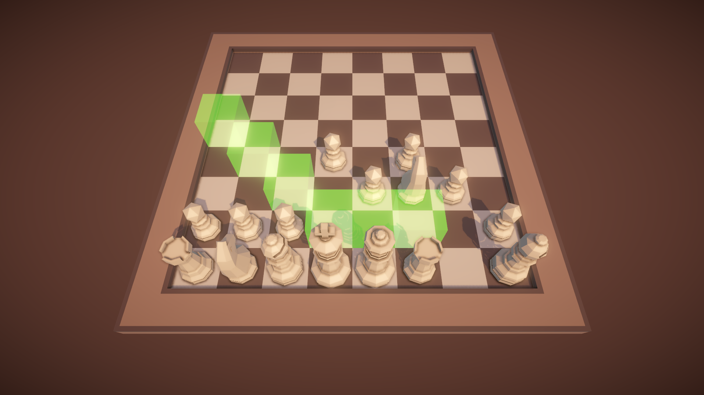

# unity-programming-theory

A chess game made as an exercise for Unity's junior programmer pathway.

Here is a screenshot. For example, the Queen has recently been selected to move.

For now, you can only move like chess, so it's more of a demo than a functional game.

Play at <a href="https://yermides.itch.io/3d-chess">My itch.io page</a>